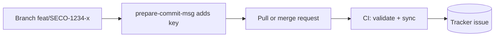

# Traceability Helper

Link every change to its tracker issue with zero developer overhead, across many
repos. Host-agnostic (GitHub, GitLab, Bitbucket), tracker-agnostic (Jira and
alternatives).

The issue key is the single thread: a hook injects it from the branch, CI
enforces it, and a provider links the change to the issue and moves it through
review and done. Process and conventions: [WORKFLOW.md](WORKFLOW.md).

## What it does

- Injects the key into commits from the branch name (Conventional-Commits safe).
- Fails CI on a branch or commit that has no key.
- Links the change to the issue, comments, and transitions state on PR events.
- Reports traceability coverage across merged changes.
- Ships ready to drop into GitHub, GitLab, or Bitbucket.

## Flow



## Code hosts

Same tool, different CI wiring. Keys come from the branch (and the request title
and body where the host exposes them).

| host      | wiring                      | template                      |
| --------- | --------------------------- | ----------------------------- |
| GitHub    | reusable workflow (`uses:`) | [examples/](examples)         |
| GitLab    | `include:` a CI template    | [ci/gitlab/](ci/gitlab)       |
| Bitbucket | merge a pipelines snippet   | [ci/bitbucket/](ci/bitbucket) |

## Trackers

Set `provider`. Keys come from the branch, title, or body.

| provider   | key shape  | links via            | transitions via        |
| ---------- | ---------- | -------------------- | ---------------------- |
| `jira`     | `PROJ-123` | remote link          | named/id transition    |
| `github`   | `#123`     | native cross-ref     | close issue / label    |
| `linear`   | `ENG-123`  | attachment           | workflow state by name |
| `youtrack` | `PROJ-123` | comment (native VCS) | `State <name>` command |
| `azure`    | `AB#123`   | hyperlink relation   | `System.State`         |
| `trello`   | card link  | URL attachment       | move card to a list    |

Jira supports Cloud (REST v3) and Data Center (REST v2, bearer PAT).

## Use on GitHub

1. Add the caller workflow ([examples/traceability.yml](examples/traceability.yml)):

   ```yaml
   jobs:
     traceability:
       uses: royzah/traceability-helper/.github/workflows/traceability.yml@v1
       with:
         provider: jira
         project_keys: "SECO,DEVOPS"
       secrets: inherit
   ```

   `secrets: inherit` passes the tracker credentials set at the org or repo
   level. Pin `@v1` to a released tag.

2. Enable the hook locally, once after cloning:

   ```sh
   ./scripts/install-hooks.sh
   ```

## Use on GitLab

Add to `.gitlab-ci.yml` and set the provider secrets as CI/CD variables:

```yaml
include:
  - remote: "https://raw.githubusercontent.com/royzah/traceability-helper/v1/ci/gitlab/traceability.yml"
```

## Use on Bitbucket

Merge [ci/bitbucket/pipelines.yml](ci/bitbucket/pipelines.yml) into
`bitbucket-pipelines.yml` and set the provider secrets as repository variables.

## Required secrets

Set these as the host's CI secrets (GitHub org/repo secrets, GitLab CI/CD
variables, Bitbucket repository variables). Only the selected provider's block
is required.

Jira:

| secret                      | required | notes                         |
| --------------------------- | -------- | ----------------------------- |
| `JIRA_BASE_URL`             | yes      | `https://org.atlassian.net`   |
| `JIRA_API_TOKEN`            | yes      | API token (Cloud) or PAT (DC) |
| `JIRA_USER_EMAIL`           | basic    | omit when `JIRA_AUTH=bearer`  |
| `JIRA_API_VERSION`          | no       | `3` Cloud (default), `2` DC   |
| `JIRA_AUTH`                 | no       | `basic` (default) or `bearer` |
| `JIRA_TRANSITION_IN_REVIEW` | no       | transition name or id         |
| `JIRA_TRANSITION_DONE`      | no       | transition name or id         |

Other providers:

- Linear: `LINEAR_API_KEY`, `LINEAR_STATE_IN_REVIEW`, `LINEAR_STATE_DONE`.
- YouTrack: `YOUTRACK_BASE_URL`, `YOUTRACK_TOKEN`, `YOUTRACK_STATE_IN_REVIEW`,
  `YOUTRACK_STATE_DONE`.
- Azure Boards: `AZURE_ORG_URL`, `AZURE_PROJECT`, `AZURE_PAT`,
  `AZURE_STATE_IN_REVIEW`, `AZURE_STATE_DONE`.
- Trello: `TRELLO_KEY`, `TRELLO_TOKEN`, `TRELLO_LIST_IN_REVIEW`,
  `TRELLO_LIST_DONE` (list ids).
- GitHub Issues: none beyond the built-in token; optional
  `GITHUB_LABEL_IN_REVIEW`.

Full reference: [tools/config.yaml.example](tools/config.yaml.example).

## Convention

- Branch: `<type>/<KEY>-<slug>`, e.g. `feat/SECO-1234-add-auth`.
- Commit: the key is appended as a suffix, e.g. `feat: add auth (SECO-1234)`.
  Override with `git config traceability.keyPlacement prefix|footer` and
  `git config traceability.keyPattern '<regex>'`.

## Enforce

Require the validation checks in branch protection (GitHub), merge-request
approvals (GitLab), or required builds (Bitbucket). CI is the gate; the hook is
convenience.

## Extending

Add a tracker: a module in `tools/trackers/` subclassing `Tracker`, registered
in `tools/trackers/__init__.py`. Add a host: a module in `tools/hosts/` that
returns a `PRContext`, registered in `tools/hosts/__init__.py`.

## Layout

```text
.githooks/                 prepare-commit-msg, commit-msg
.github/workflows/         traceability.yml, metrics.yml (reusable), ci.yml
ci/gitlab/, ci/bitbucket/  host CI templates
examples/                  GitHub caller workflows
scripts/install-hooks.sh   sets core.hooksPath
tools/sync.py              change -> tracker entry point
tools/metrics.py           coverage report
tools/hosts/               base + github, gitlab, bitbucket
tools/trackers/            base + jira, github, linear, youtrack, azure, trello
```

## License

MIT. See [LICENSE](LICENSE). Setup: [IMPLEMENTATION_GUIDE.md](IMPLEMENTATION_GUIDE.md).
