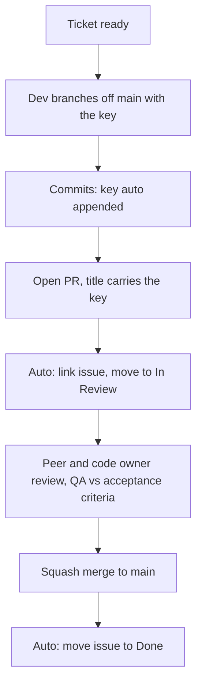

# How to use it properly

One rule: every change carries an issue key. Automation does the bookkeeping, so
people spend attention on judgement (design, correctness, acceptance) instead of
typing keys. The only new developer habit is naming the branch.

## Roles, at a glance

| role                 | owns                                    | the one thing they must do          |
| -------------------- | --------------------------------------- | ----------------------------------- |
| Product / PM         | the backlog ticket: problem and value   | write the why, set priority         |
| Tech lead, architect | scope, design note, splitting tickets   | acceptance criteria with QA         |
| Developer            | the change                              | branch with the key, small PR       |
| Reviewer (peer)      | correctness, design, readability        | approve or request changes, briefly |
| QA                   | the change meets acceptance criteria    | verify before Done                  |
| Code owner           | a sensitive path (auth, infra, CI)      | review changes under that path      |
| Maintainer, release  | merge strategy, tags, branch protection | keep the default branch releasable  |

Nobody re-types the key, links the issue, or moves its state. That is automated.

## Where a ticket comes from

The source sets the type and who owns the description.

| source                  | type         | prefix         | description owned by     |
| ----------------------- | ------------ | -------------- | ------------------------ |
| Product / PM backlog    | feature      | `feat`         | PM, with the lead        |
| Requirement, compliance | feature/task | `feat`/`chore` | requirement owner + lead |
| Architecture, design    | design task  | `feat`         | architect (design note)  |
| Defect report           | bug fix      | `fix`          | reporter + QA            |
| Tech debt, upkeep       | chore        | `chore`        | lead                     |
| Open question           | spike        | `spike`        | whoever raises it        |

## Definition of ready

A ticket is ready to start when it has: a type and clear title; a description of
the problem and value (not a solution); acceptance criteria (what proves it
done); an owner and a priority. If any are missing, groom it before the sprint,
not after.

## Branching: the developer decides

Short-lived, one per ticket, cut off the current default branch and named with
the key. Do not auto-create branches from the tracker.

```sh
git switch main && git pull
git switch -c feat/PROJ-1234-add-auth   # <type>/<KEY>-<slug>
./scripts/install-hooks.sh              # once per clone
```

- One ticket per branch, one branch per ticket. Split large tickets first.
- Branch from `main`, rebase on `main`, merge back. No long-lived shared branches.
- The key in the branch name is the only manual link. Commits, the PR, and the
  issue connect from it automatically.

## Pull requests: squash, and put the key in the title

The merge strategy is squash and merge, only. One ticket becomes one branch and
one atomic, revertable commit on the default branch. On squash the PR title
becomes that commit, so it must carry the key and follow Conventional Commits:

```text
<type>: <summary> (KEY)        feat: add OIDC login (PROJ-1234)
```

For the description, use the template at `.github/pull_request_template.md`:
What, Why (with `Closes KEY`), How tested, Risk and rollout. Write it for a
future reader who was not in the room.

- Keep PRs small and single concern. If scope grows, split and cross-reference keys.
- Open as draft while in progress, mark ready for review when CI is green.
- Let the merge auto-delete the branch.

## Review: what each role checks

Keep reviews fast and specific. A focused PR earns a focused review.

- Peer reviewer: does it do what the title says? Is the design the simplest that
  works? Edge cases, error paths, and tests present? Readable by the next person?
- Code owner (that path only): security, blast radius, backward compatibility,
  migration and rollback for the area.
- QA: acceptance criteria met, and the unhappy paths tried, not just the happy one.
- Author, before requesting review: self-review the diff, CI green, description
  complete. Do not outsource the first read.

## Lifecycle



## Automated versus manual

Manual, by the developer: branch off `main` with the key, open the PR with a
keyed title, get review. Automatic, by this tooling: append the key to commits,
fail CI on a missing key, link the PR to the issue and comment, move the issue to
In Review on open and Done on merge, report coverage. That asymmetry is the
design goal: learn one naming convention, and the rest is free.

## Definition of done

- Acceptance criteria met and verified by QA.
- Reviewed (peer plus any code owner) and squash merged to `main`.
- CI green, including the traceability checks.
- The issue shows the linked PR and has moved to Done (automatic).

## Good practice, in one list

- Small, focused PRs are easier to review and to trace.
- Conventional Commits in the commit and the PR title, with the key as a suffix.
- One concern per ticket. Split and cross-reference when scope grows.
- Revert is one step because history is squashed and linear.
