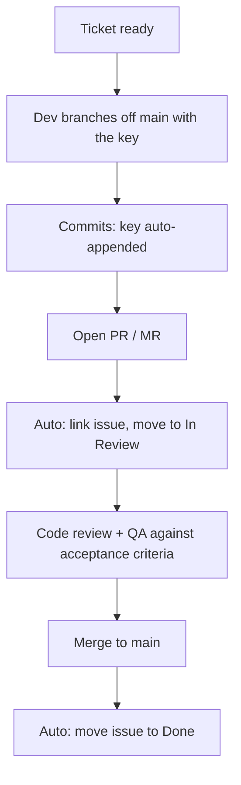

# How to use it properly

One rule: every change carries an issue key. The practice below makes that trace
real, with one new developer habit: naming the branch.

## Where a ticket comes from

The source sets the type and who owns the description.

| source                   | ticket type  | prefix         | description owned by     |
| ------------------------ | ------------ | -------------- | ------------------------ |
| Product / PM backlog     | feature      | `feat`         | PM, with the lead        |
| Requirement / compliance | feature/task | `feat`/`chore` | requirement owner + lead |
| Architecture / design    | design task  | `feat`         | architect (design note)  |
| Defect report            | bug fix      | `fix`          | reporter + QA            |
| Tech debt / upkeep       | chore        | `chore`        | lead                     |
| Open question            | spike        | `spike`        | whoever raises it        |

A feature traces to product or a requirement, a fix to a defect, a design task
to an architecture decision. The key makes that trace navigable later.

## Definition of ready

A ticket is ready to start when it has all of:

- A type (from the table above) and a clear title.
- A description that states the problem and the value, not a solution. For a
  design task, the architect attaches the design note or links the decision.
- Acceptance criteria written by the lead or QA: what proves it is done.
- An owner and a priority.

Roles, briefly: the reporter or PM states the problem and value; the lead or
architect adds design and scope; QA defines acceptance criteria. A ticket
missing these is groomed before it enters a sprint, not after.

## Branching: keep it the developer's call

A short-lived branch per ticket, cut by the developer off the current default
branch and named with the key. Do not auto-create branches from the tracker; let
the developer branch when work starts and keep it close to `main`.

```sh
git switch main && git pull
git switch -c feat/SECO-1234-add-auth   # <type>/<KEY>-<slug>
./scripts/install-hooks.sh              # once per clone
```

Rules that keep it clean:

- One ticket per branch, one branch per ticket. Split large tickets first.
- Branch from `main`, rebase on `main`, merge back to `main`. No long-lived
  shared feature branches.
- The key in the branch name is the only manual link needed; commits, the
  request, and the issue connect automatically from it.

## Lifecycle



## What is automated vs manual

Manual, by the developer:

- Branch off `main` with the key in the name.
- Open the pull or merge request.

Automatic, by this tooling:

- Append the key to every commit subject.
- Fail CI if a branch or commit has no key.
- Link the request to the issue and comment on it.
- Move the issue to In Review on open, to Done on merge.

That asymmetry is the design goal: the developer learns one naming convention
and the rest is free.

## Definition of done

- Acceptance criteria met and verified by QA.
- Change reviewed and merged to `main`.
- CI green, including the traceability checks.
- The issue shows the linked request and has moved to Done (automatic).

## Good practice, in one list

- Small, focused requests; easier to review and to trace.
- Conventional Commits subjects (`feat:`, `fix:`, `chore:`); the key rides as a
  suffix and stays out of the type.
- One concern per ticket; if scope grows, split and cross-reference keys.
- Write the description for a future reader who was not in the room.
